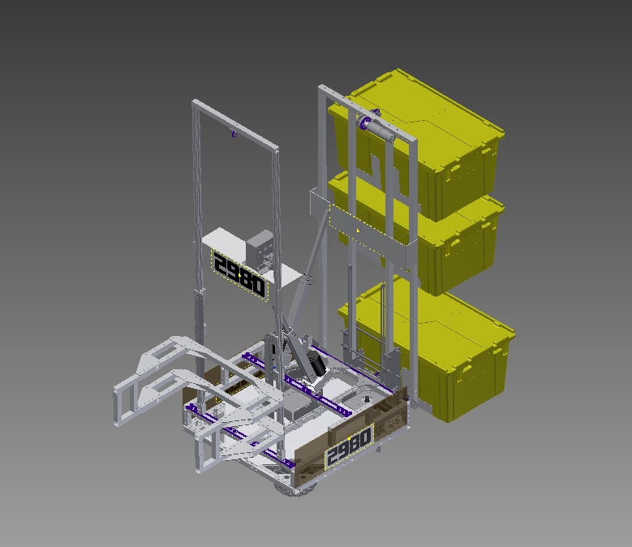

#Swishper

Swishper is team 2980's robot for Recycle Rush in 2015. It is designed to complete a three tote auto and a six tote stack in teleop. [Checkout the CAD files!](Swishper)

###Four Subsystems
* Holomonic Drive Train
* Gripper Lift Mechanism (Front)
* Randall's Lift Mechanism (Rear)
* Battery Shifting Mechanism

####Holomonic Drive Train

The wheels are set up in a circular pattern using omni-wheels for multi-directional movement. By having a circular pattern for a drive train, rotation is circular and quick in maneuverability.

####Gripper Lift Mechanism

This lift mechanism has the claw which gives the ability to pick up both totes and recycling containers. What makes this different than Randall's Lift Mechanism is by having a "claw" that grip game pieces. A DART actuator is used to open and close the claws and therefore, they secure game pieces/load. This mechanism shifts from a DART Actuator to maintain a center of gravity.

####Randalls Lift Mechanism

This mechanism was recommended by one of our members, Randall Hines, and functions to pick up two crates at a time. A bracket is first lifted to pick a tote. Then a second bracket picks up another tote. By having the ability to suspended totes, the mechanism can be lowered onto a tote and to make a stack of three. This mechanism shifts from a DART Actuator to maintain a center of gravity.

####Battery Shifting Mechanism

Due to the robot being tall, the center of gravity will change. The battery will change throughout a match if one side of the robot happens to shift. The battery weighs about 12 lbs and moving the battery from either front to back will find a perfect balance. A gyro sensor will be added to help calculate the necessary shift.

